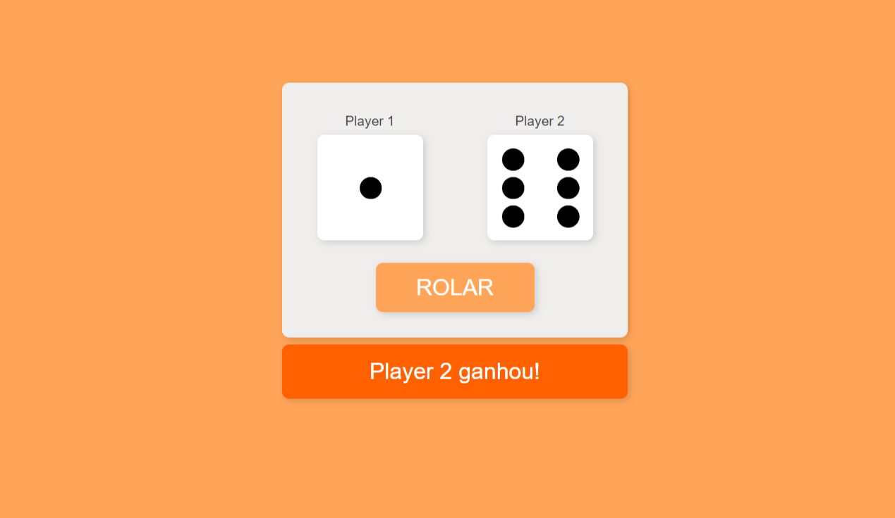

# DiceRoll

Um simples projeto que compara o resultado de 2 dados.
## Screenshot

## Link para acesso

[Clique aqui!](https://enzozaqueu.github.io/diceRoll/)

## Tecnologias

- HTML
- CSS
- JS
- Git e GitHub

## Recursos úteis
​
- [devdocs](https://devdocs.io/css/css_values_and_units) - Documentação diversa.

## Contato

[Linkedin](https://www.linkedin.com/in/enzo-zaqueu-780378149/)